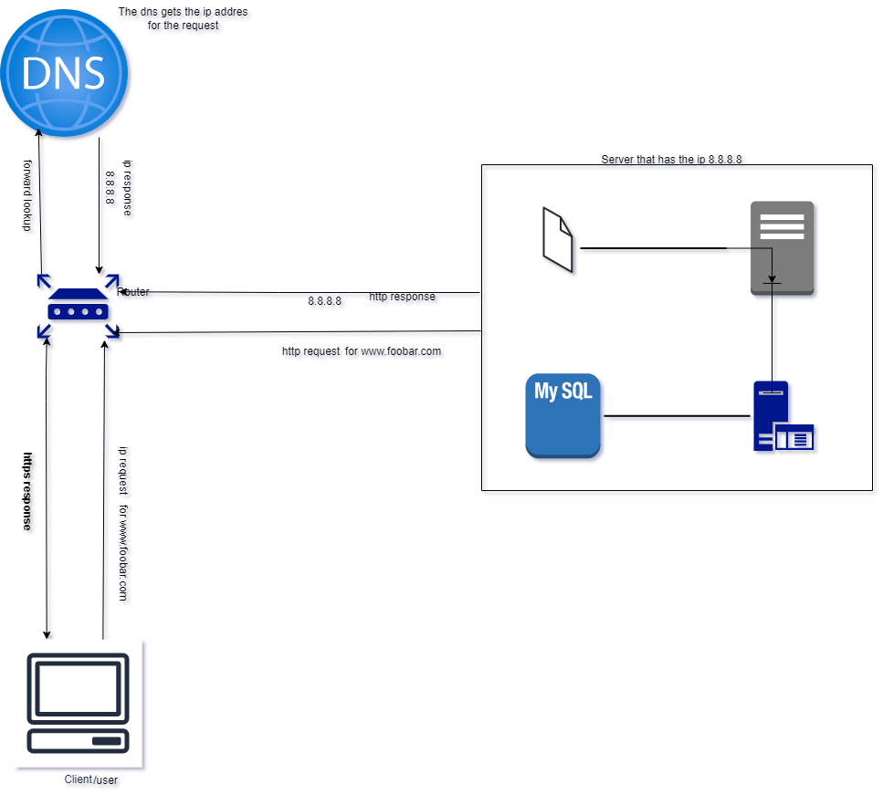

- What is a server
- What is the role of the domain name
- What type of DNS record www is in www.foobar.com
- What is the role of the web server
- What is the role of the application server
- What is the role of the database
- What is the server using to communicate with the computer of the user requesting the website
- explain what the issues are with this infrastructure:
- SPOF
- Downtime when maintenance needed (like deploying new code web server needs to be restarted)
- Cannot scale if too much incoming traffic
