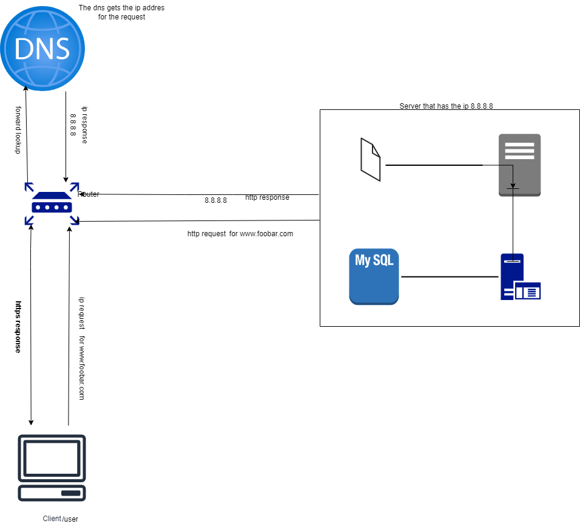

# explain some specifics about this infrastructure:

- For every additional element, why you are adding it
- What distribution algorithm your load balancer is configured with and how it works
- Is your load-balancer enabling an Active-Active or Active-Passive setup, explain the difference between both
- How a database Primary-Replica (Master-Slave) cluster works
- What is the difference between the Primary node and the Replica node in regard to the application
# explain what the issues are with this infrastructure:
- Where are SPOF
- Security issues (no firewall, no HTTPS)
- No monitoring
