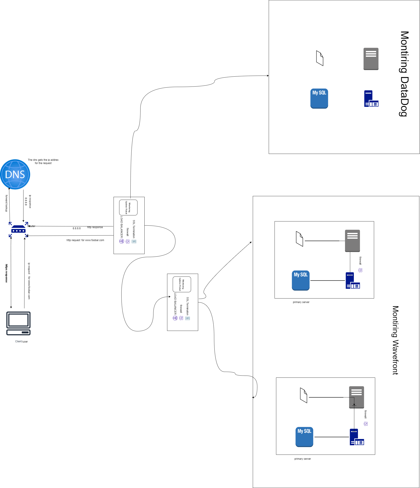

1 server

- 1 load-balancer (HAproxy) configured as cluster with the other one

Split components (web server, application server, database) with their own server

You must be able to explain some specifics about this infrastructure:

For every additional element, why you are adding it
